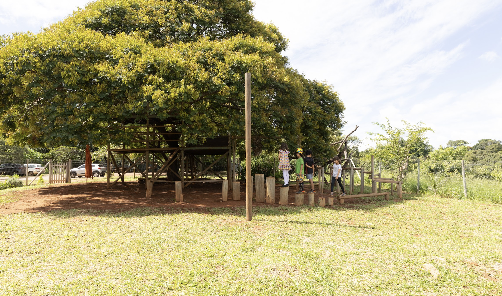
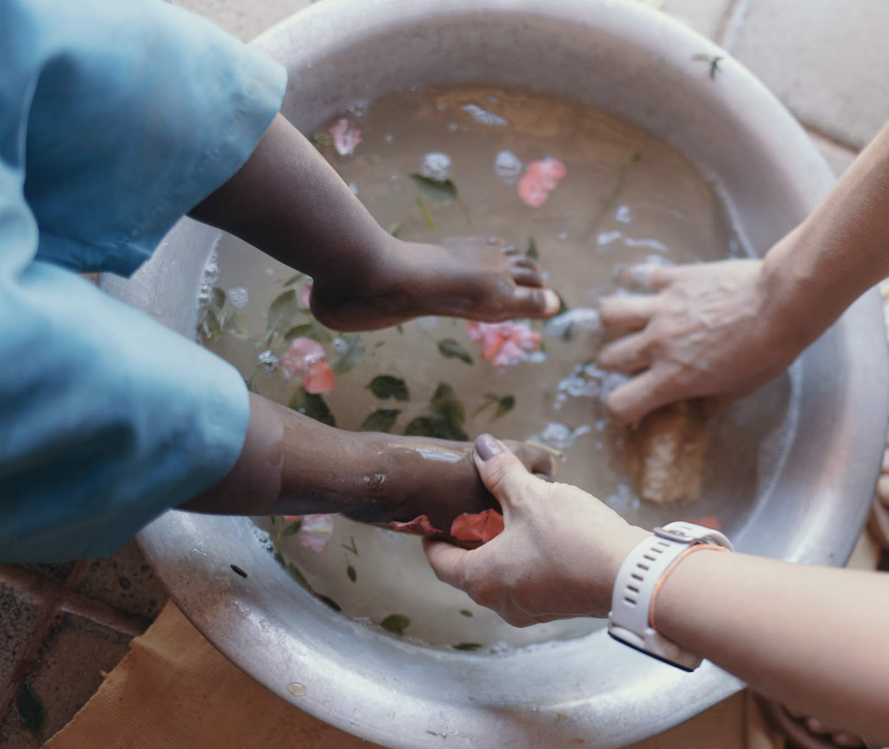

+++
title = "Nossa História"
description = "Como a Pequi nasceu, em 2014, de um desejo coletivo."
+++

Como a Pequi nasceu, em 2014, de um desejo coletivo.
A Escola Waldorf Rural Pequizeiro nasceu em 2014, do desejo de um grupo de famílias e educadoras de dar à infância um espaço onde ela pudesse ser vivida por inteiro — o corpo em movimento, as mãos em atividade, a imaginação em liberdade. Não existia, até então, em Brasília, uma escola que unisse a Pedagogia Waldorf ao contato diário com o Cerrado; a Pequi nasceu para preencher esse espaço.

Começamos pequenos: um grupo reduzido de crianças, um espaço adaptado, muita disposição para aprender fazendo. Ano após ano, a escola cresceu sem perder o que a fez nascer — o cuidado com cada criança e o compromisso com uma comunidade que educa em conjunto. Hoje reunimos famílias de diferentes regiões de Brasília, todas escolhendo para seus filhos uma infância com os pés na terra vermelha do Cerrado.

Ao longo desse percurso, filiamo-nos à FEWB — Federação das Escolas Waldorf no Brasil —, o que aproxima nossa prática da rede de escolas Waldorf do país e reafirma o compromisso com os princípios que orientam essa pedagogia em solo brasileiro.
Seguimos construindo, com as famílias, uma escola pensada para formar seres humanos livres — capazes de pensar por conta própria e de agir no mundo com responsabilidade e sensibilidade. Os mesmos valores que nos trouxeram até aqui continuam guiando cada decisão que tomamos hoje.

Linha do tempo
2014 — Fundação da escola, a partir da iniciativa de um grupo de famílias e educadoras.
[ano] — Filiação à FEWB (Federação das Escolas Waldorf no Brasil).
[ano] — Ampliação de turmas e estrutura.

