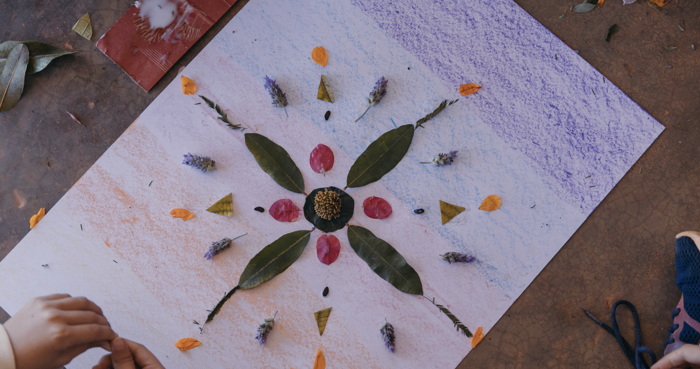

+++
title = "Pedagogia Waldorf"
description = "Os princípios que orientam nosso trabalho pedagógico."
+++

A **Pedagogia Waldorf** nasceu há mais de 100 anos da compreensão de que educar
é acompanhar o desenvolvimento do ser humano por inteiro — pensar, sentir e agir.

Organizamos o olhar sobre cada criança a partir dos setênios: ciclos de sete
anos em que as necessidades de aprendizagem se transformam. Por isso a rotina,
os materiais e até a forma como ensinamos mudam de fase para fase.

## Os setênios

| Ciclo | Idade | O que se desenvolve |
|---|---|---|
| Primeiro setênio | 0 a 7 anos | O corpo e a vontade, pela imitação e pelo brincar |
| Segundo setênio | 7 a 14 anos | O sentir, pela imagem, pelo ritmo e pela arte |
| Terceiro setênio | 14 a 21 anos | O pensar autônomo e o juízo próprio |

Nosso trabalho também é guiado pelos direitos de aprendizagem que sustentam
a educação infantil: brincar, conviver, participar, explorar, expressar-se e
conhecer-se.

