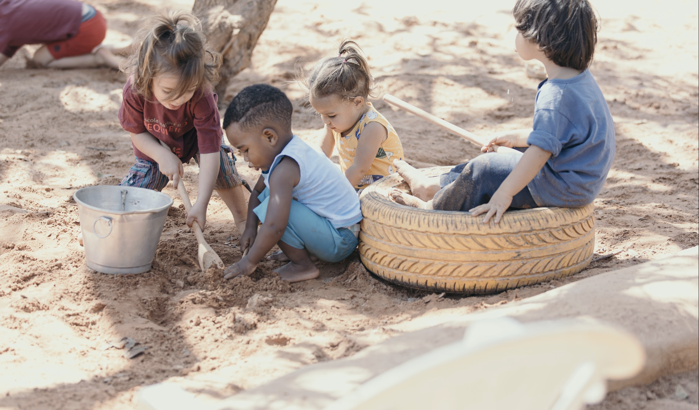

+++
title = "Ensino"
description = "Do Berçário ao Ensino Fundamental I, respeitando o tempo de cada fase."
+++

Acompanhamos cada criança do Maternal ao Ensino Fundamental I, respeitando
o tempo de cada fase da vida.

Essa é talvez a ideia mais importante para uma família visitante entender:
a Pequi não aplica a mesma rotina a idades diferentes. Cada fase —
detalhada nas três páginas a seguir — tem seu próprio ritmo, seus próprios
materiais e sua própria forma de aprender.
