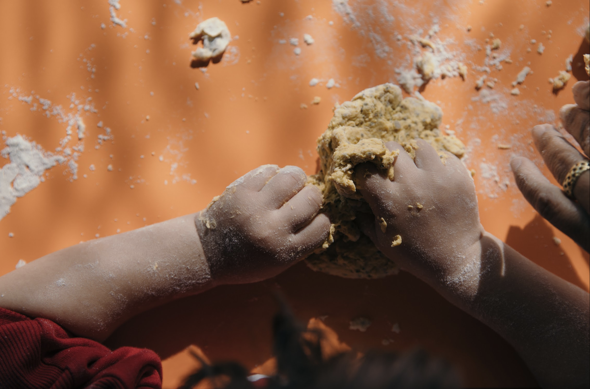
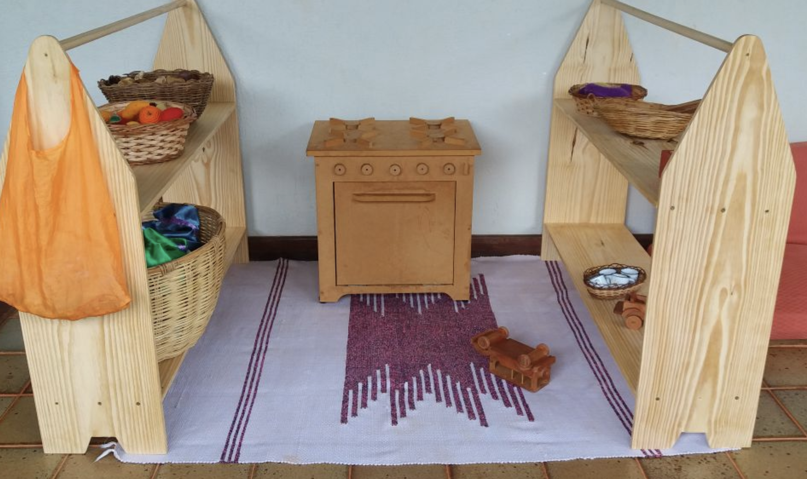

+++
title = "Berçário e Maternal"
faixa = "1 ano e 6 meses a 3 anos e 11 meses"
description = "Acolhimento e ritmo como eixos da descoberta."
weight = 10
+++

Um ambiente de acolhimento e ritmo, onde interações e brincadeiras são os eixos que sustentam a descoberta de si e do mundo.

#### A rotina do dia

Nessa fase, mais do que qualquer atividade específica, o que sustenta o desenvolvimento é a previsibilidade: a criança pequena se sente segura quando reconhece o que vem a seguir. Por isso a rotina se repete quase igual todos os dias, sempre conduzida pela mesma educadora de referência.
O dia começa com um acolhimento individual — cada criança é recebida por seu nome, no seu tempo. Segue-se uma roda breve com canções simples, um longo período de brincar livre em um ambiente preparado para a exploração sensorial, momentos de higiene e troca vividos sem pressa, alimentação em pequenos grupos e um tempo de descanso respeitando o ritmo de sono de cada bebê. Sempre que o tempo permite, uma parte do dia acontece ao ar livre, em contato direto com terra, água e plantas.

#### Materiais e brinquedos

Os materiais dessa fase são, de propósito, simples: madeira, lã, algodão, sementes, conchas — nada que já venha com uma função definida. Os bebês exploram cestos de tesouros, com pequenos objetos naturais do cotidiano para descobrir com as mãos e a boca; as crianças um pouco maiores brincam com panos e tecidos naturais, que viram tenda, capa ou ninho, e com bonecas de pano simples, feitas para acolher, não para impressionar.
Não há brinquedos eletrônicos, telas ou sons pré-gravados. A ideia é que o brinquedo não determine de antemão a brincadeira — é a imaginação da criança que decide o que aquele pedaço de madeira vai ser.
