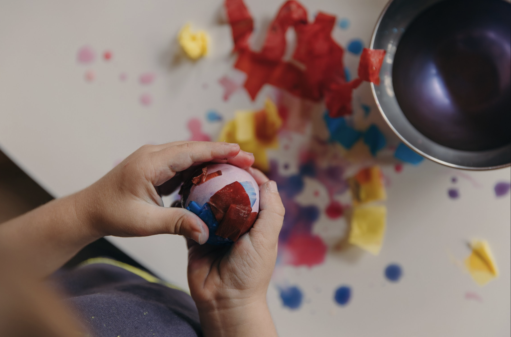

+++
title = "Educação Infantil"
faixa = "4 a 6 anos"
description = "O brincar como linguagem principal."
weight = 20
+++

### Educação Infantil
O brincar como linguagem principal: de forma lúdica, simbólica e cheia de encantamento, a criança constrói suas primeiras hipóteses sobre o mundo.

### A rotina do dia
O dia começa com uma roda matinal — canções, versos e rimas que mudam conforme a estação do ano — e segue para um tempo generoso de brincar livre, que aqui é entendido como o verdadeiro trabalho da infância. Ao longo da semana, entram atividades artísticas em rodízio: aquarela com a técnica do úmido sobre úmido, modelagem com cera de abelha ou argila, desenho de formas. Mais perto dos seis anos, surgem os primeiros trabalhos manuais, como costura simples.

Todos os dias há um momento de contação de história — contada, não lida, muitas vezes um conto de fadas clássico repetido por uma semana inteira, para que a criança possa se aprofundar nele. As refeições incluem alguma participação das crianças no preparo simples dos alimentos, e uma parte do dia acontece sempre ao ar livre, explorando o Cerrado ao redor da escola em qualquer estação.

### Materiais e brinquedos

Os brinquedos continuam não estruturados — troncos, tecidos, cascas, sementes, conchas — capazes de virar qualquer coisa que a brincadeira pedir. As salas têm cantos temáticos, como o cantinho da casinha, montados com elementos naturais em vez de réplicas de objetos reais. As bonecas são feitas artesanalmente, com traços simples que deixam espaço para a criança projetar expressões e sentimentos.
Instrumentos musicais simples e de afinação pentatônica, como a lira (kinderharp), fazem parte do dia a dia, assim como uma mesa de estações que vai mudando ao longo do ano — flores, frutos, sementes ou galhos secos, conforme o que a natureza está oferecendo lá fora.
