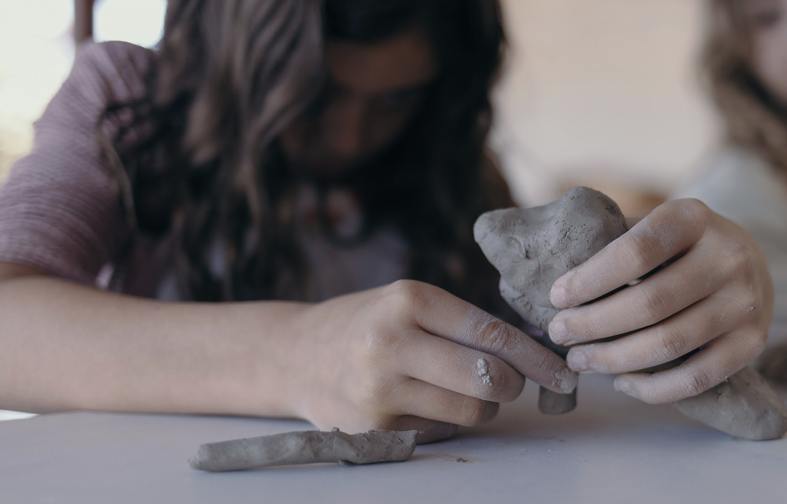

+++
title = "Ensino Fundamental I"
faixa = "7 a 10/11 anos"
description = "Currículo entrelaçado à arte, ao trabalho manual e à natureza."
weight = 30
+++

Currículo tradicional entrelaçado à arte, ao trabalho manual e ao contato diário com a natureza, respeitando o despertar gradual do pensamento mais abstrato.

### A rotina do dia

As primeiras horas da manhã são dedicadas à aula principal — o período em que a mente está mais desperta para o pensamento concentrado. Ao longo do dia, a rotina alterna momentos de concentração com momentos de movimento, respeitando o que os professores Waldorf chamam de respiração pedagógica: inspirar (concentrar) e expirar (mover), como um ritmo que evita o cansaço mental.
À tarde entram as aulas especializadas: língua estrangeira, euritmia, música e flauta doce, artes plásticas, trabalhos manuais e tricô, jardinagem e educação física. Cada aula começa e termina com pequenos rituais — uma roda, um verso, um canto — que ajudam a criança a fazer a transição de uma atividade para outra.

### As épocas

O currículo do Fundamental I é organizado em épocas: blocos de três a quatro semanas em que uma única disciplina — matemática, língua portuguesa, história, geografia ou ciências — é aprofundada todas as manhãs, antes de dar lugar a outra. Em vez de fragmentar o dia em muitas matérias soltas, a turma mergulha de verdade em um assunto de cada vez.
Ao longo dos anos, os mesmos temas voltam em ciclos, sempre com uma camada a mais de profundidade e abstração, acompanhando o amadurecimento da turma. E em vez do livro didático pronto, cada criança constrói seu próprio caderno de época — escrito e ilustrado à mão —, que se torna, ano após ano, um registro pessoal de tudo o que aprendeu.
