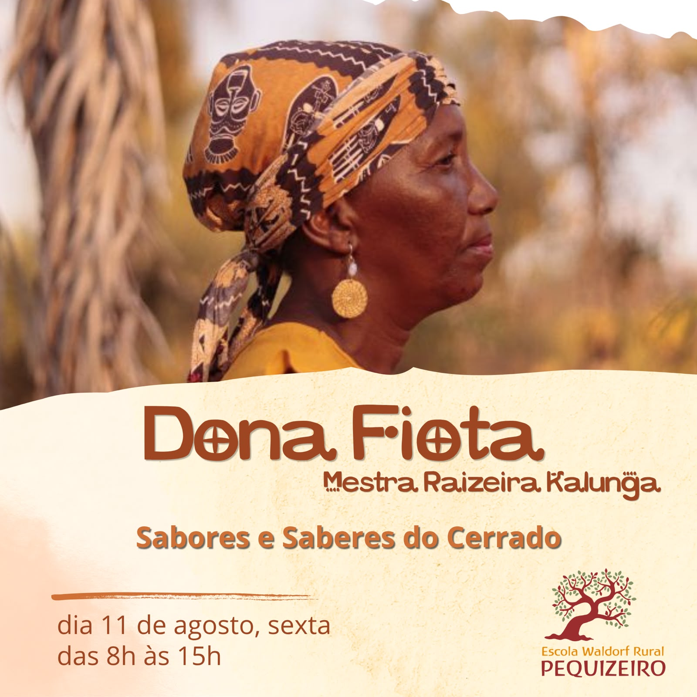

+++
title = "Dona Fiota: Sabores e Saberes do Cerrado"
date = 2026-09-04
categorias = ["Eventos"]
draft = false
+++

Dona Fiota, referência viva da cultura quilombola e dos saberes ancestrais do território Kalunga, personifica a memória, as sementes e os sabores do Cerrado.

🔆 Amanhã ela estará em nosso Pequizeiro!

Venha conhecer seus produtos e se aproximar dos saberes ancestrais que ela guarda, cultiva e compartilha com sua Comunidade.

🤲🏽 Convide seus amigos, esse momento será aberto ao público externo!

Com carinho,
Escola Waldorf Rural Pequizeiro
〰️〰️〰️
Dona Fiota no Pequizeiro
dia 11/09, sexta
das 8h às 15h