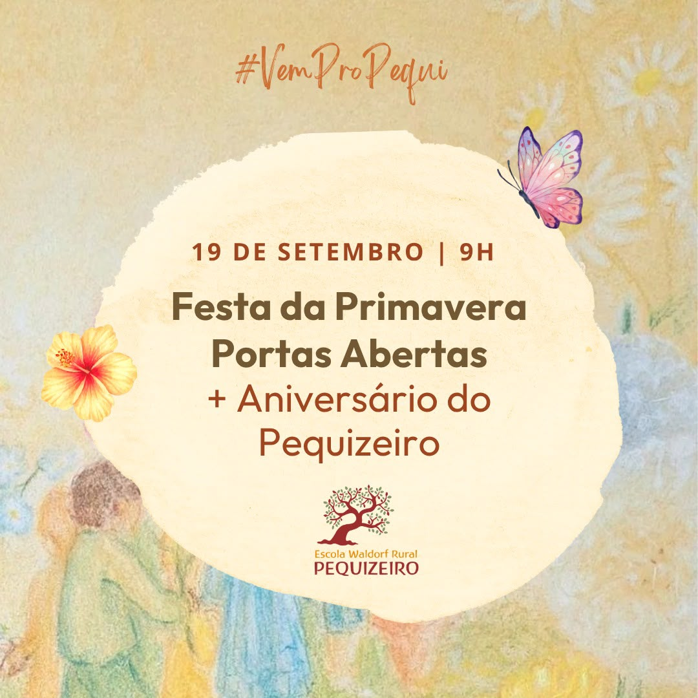

+++
title = "Festa da Primavera | 2026"
date = 2026-09-04
categorias = ["Eventos"]
draft = false
+++

:cherry_blossom: Festa da Primavera \| Escola Waldorf Rural Pequizeiro

No Cerrado, a Primavera tem seu próprio ritmo. Depois do tempo de estiagem, a paisagem começa a se transformar. A terra recebe novas águas, a vida desperta e, pouco a pouco, o mundo ao nosso redor volta a florescer.

Na pedagogia Waldorf, as festas do ano nos convidam a vivenciar esses ritmos da natureza e a perceber, através da experiência, os movimentos de recolhimento, despertar, crescimento e renovação que também fazem parte da vida.

A Primavera nos traz justamente essa imagem: o despertar da vida, a expansão e o florescimento de novas possibilidades.

E neste ano, temos ainda mais uma razão para celebrar. No dia 18 de setembro, a Escola Waldorf Rural Pequizeiro completa mais um ano de sua história. :sparkles:

No dia 19 de setembro, a partir das 9h, nos reuniremos para celebrar a Primavera e a vida da nossa Escola, em um dia de encontro, alegria, natureza e comunidade.

:orange_heart: Nossa Escola estará de portas abertas!

Convidamos as famílias que desejam conhecer nossa Escola para caminharem conosco por nossos espaços, sentir o ambiente e conhecer um pouco da beleza e da essência da pedagogia Waldorf. :round_pushpin:Visita guiada às 10h

