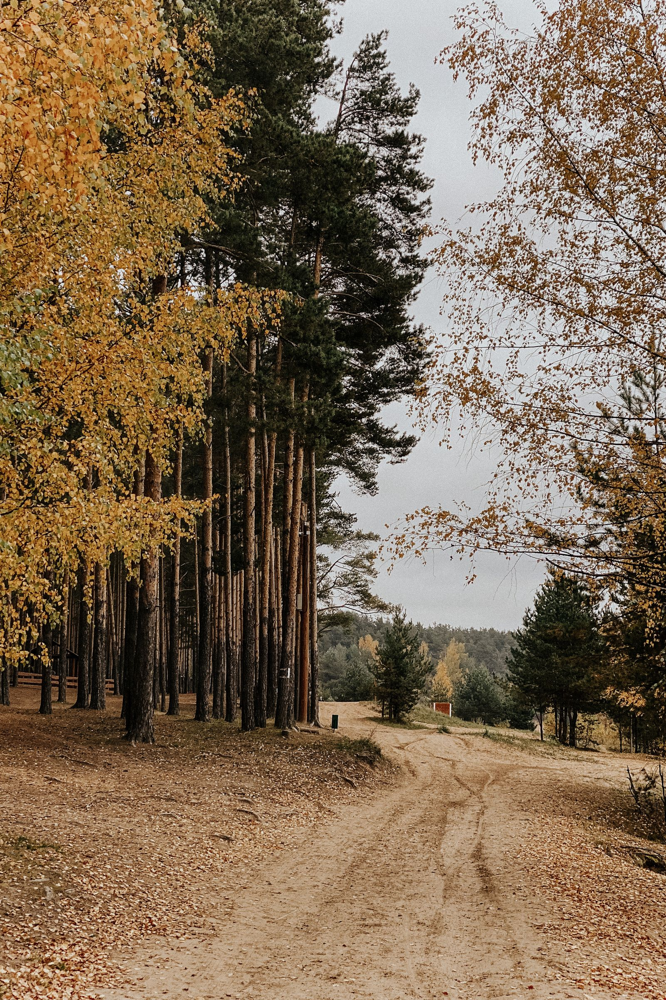

+++
title = "Como aprendemos"
description = "A pedagogia Waldorf aplicada ao chão do Cerrado."
layout = "simple"
+++

A pedagogia Waldorf organiza o aprendizado em ciclos de sete anos e
trata pensar, sentir e agir como partes de um mesmo movimento.

## Educação infantil (3 a 6 anos)

Lorem ipsum dolor sit amet, consectetur adipiscing elit. Sed do eiusmod tempor incididunt ut labore et dolore magna aliqua.

## Ensino fundamental I (7 a 10 anos)

Ut enim ad minim veniam, quis nostrud exercitation ullamco laboris nisi ut aliquip ex ea commodo consequat. Duis aute irure dolor in reprehenderit.

## Ensino fundamental II (11 a 14 anos)

Lorem ipsum dolor sit amet, consectetur adipiscing elit. Sed do eiusmod tempor incididunt ut labore et dolore magna aliqua.

