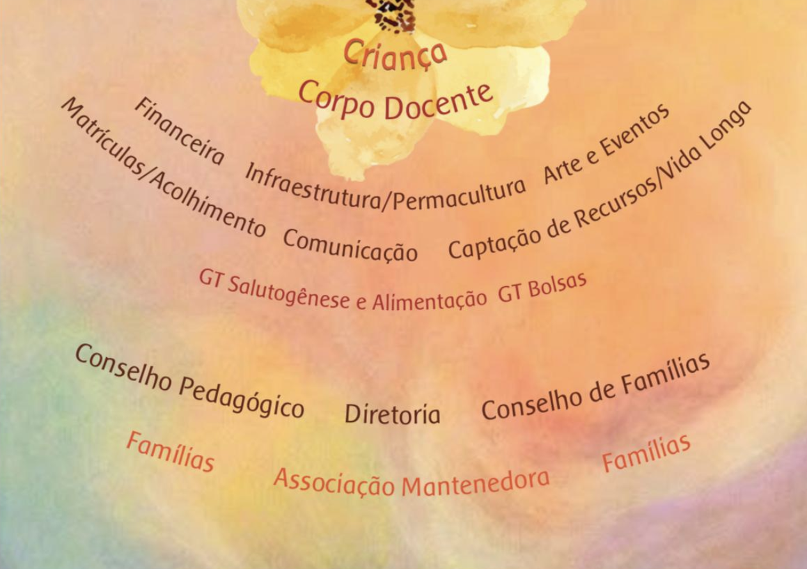

+++
title = "Gestão Colaborativa"
description = "Como famílias e educadores dividem a responsabilidade pela escola."
+++

Todos os participantes são convidados a contribuir com suas possibilidades e habilidades
no processo de gestão. Esse envolvimento reflete o princípio da
trimembração social, em que a colaboração fortalece a comunidade
escolar — para a Antroposofia, esse exercício é também um movimento de
autoeducação.

## As comissões

- Comissão Financeira
- Comissão de Infraestrutura/Permacultura
- Comissão de Arte e Eventos
- Comissão de Matrículas/Acolhimento
- Comissão de Comunicação
- Comissão de Captação de Recursos/Vida Longa

**Canais oficiais de comunicação**  
Secretaria escolar: (61) 9.9816-2015  
Conselho Pedagógico: conselhopedagogicopequi@gmail.com  
Diretoria da Associação: diretoria@escolapequizeiro.com.br
