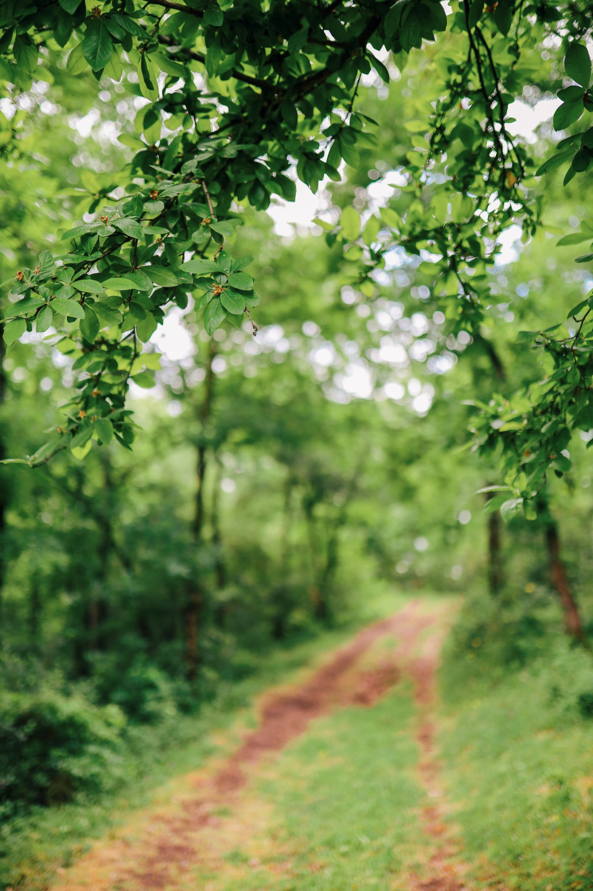

+++
title = "Vida no Pequi"
layout = "vida"
description = "A rotina, as festas sazonais e a alimentação — o cotidiano real da escola."
+++

Aqui, o dia começa em roda e termina em roda. Entre um momento e outro, há
tempo para brincar ao ar livre, para o trabalho manual, para uma refeição
feita com carinho e para celebrar, junto com as famílias, as festas que
marcam as estações do ano.

## Alimentação

Nossa alimentação é pensada com a mesma atenção que dedicamos à pedagogia:
ingredientes saudáveis, muitas vezes colhidos na própria horta da escola.

## Um dia na Pequi



## Festas sazonais

As festas seguem o ciclo das estações. Famílias são bem-vindas em todas elas.
