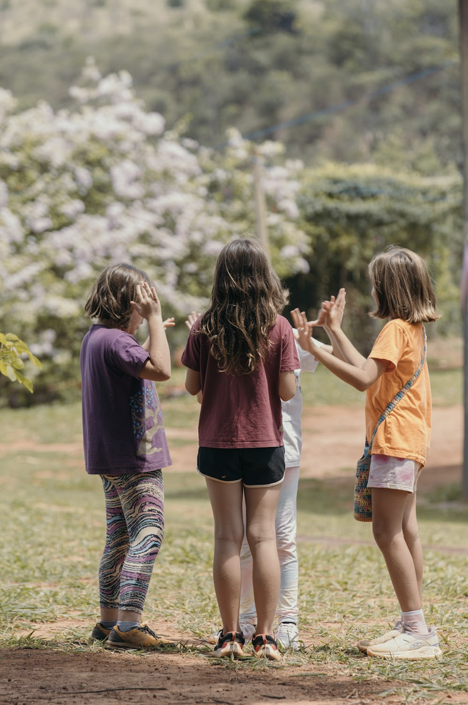
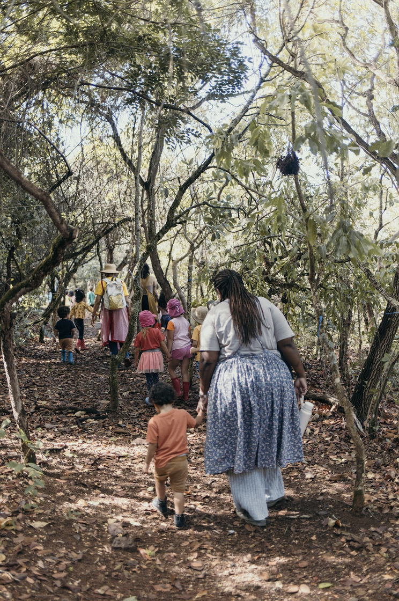
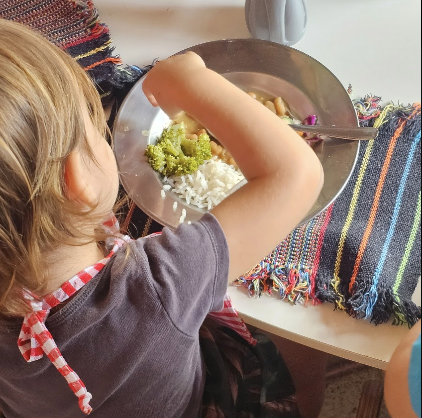

+++
title = "Vida no Pequi"
layout = "vida"
description = "A rotina, as festas sazonais e a alimentação — o cotidiano real da escola."
+++

Aqui, o dia começa em roda e termina em roda. Entre um momento e outro,
há tempo para brincar ao ar livre, para o trabalho manual, para uma
refeição feita com carinho e para celebrar, junto com as famílias, as
festas que marcam as estações do ano.

## Alimentação

Contamos com uma experiente nutricionista e cozinheira para o preparo
das refeições. Os alimentos são selecionados, preferencialmente
orgânicos, e não incluem carnes. Os almoços estão inclusos nos
contratos das modalidades Integral, Semi Integral, Ensino Fundamental
(2 vezes por semana) e turmas de Maternal.

O lanche é um momento educativo de celebração na rotina da escola — as
crianças ajudam na preparação de alguns lanches e na arrumação da
sala. No Ensino Fundamental, todos os dias das 8h45 às 9h temos a
pausa da fruta, momento em que as crianças voltam do trabalho na
terra.

Priorizamos alimentos naturais e caseiros, evitando industrializados,
açúcar refinado, balas, chocolates e fast food. Água é a bebida
principal; quando houver suco, que seja natural.

## As festas sazonais

Na Pedagogia Waldorf, celebrar é uma arte a ser cultivada — as festas
nos orientam no ciclo anual e conectam a todos com o mundo e suas
estações. A participação das famílias nessas datas é muito importante
para as crianças.

Realizamos quatro festas principais ao longo do ano:

- Festa da Lanterna
- Festa de São João
- Festa da Primavera
- Bazar de Natal

